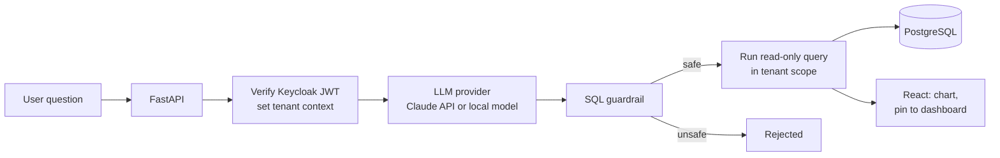

# Natural-Language BI Platform (overview)

A multi-tenant business intelligence platform that lets business users ask questions about their company data in plain language, see the answer as a chart, and pin it to their own dashboard. I am building it as the sole developer during my software engineering internship at Inteley (May 2026 – present).

> **The code is proprietary and belongs to Inteley.** This repository describes the project only: what it does, how it is put together and the decisions behind it. It contains no source code or customer data.

**Stack:** Python · FastAPI · SQLAlchemy 2.0 · PostgreSQL · Keycloak (OIDC) · React · TypeScript · Vite · Tailwind CSS · Recharts · react-grid-layout · Docker Compose

---

## What it does

- **Ask in plain language.** A chat interface turns a question like "monthly revenue by region this year" into SQL, runs it, and returns the result.
- **See it as a chart.** Results render as area, bar, line or pie charts with Recharts.
- **Build a personal dashboard.** Any chart can be pinned as a widget. Widgets are arranged and resized with drag and drop, and the layout is saved per user.
- **Keep companies apart.** Each company (tenant) only ever sees its own data.
- **Run on-premise if needed.** The LLM provider is pluggable: a hosted model or a local model served with LM Studio, for customers whose data must not leave their network.

## How a question is answered

## Design decisions

### SQL generated by an LLM is untrusted input

The model can make mistakes, and a user can try to talk it into writing a harmful query. So generated SQL goes through several independent layers before it touches the database:

1. **Parse and inspect the query.** Only a single read-only statement is accepted. Write and schema commands (`INSERT`, `UPDATE`, `DELETE`, `DROP`, `TRUNCATE` …), multiple statements chained together and access to system catalogs are rejected.
2. **Use a read-only connection.** Even if something slipped past the first layer, the database user cannot change data.
3. **Limit the cost.** Queries run with a timeout and a row limit, so a heavy query can't hang the system.

Each layer works on its own, so one mistake doesn't open the whole system.

### Tenant isolation lives in the data layer, not in each endpoint

Instead of remembering to add a "filter by company" condition in every endpoint, the tenant is resolved once per request from the JWT and stored in a request-scoped context. SQLAlchemy global filters then apply it to every query automatically. A forgotten filter in new code can't leak another company's data.

### Identity is delegated to Keycloak

Sign-in, roles and the admin approval of new users are handled by Keycloak over OIDC. The backend only verifies tokens and reads claims, so the app never stores passwords. Invitation and activation emails are sent through a transactional email service.

### One command to run everything

PostgreSQL, Keycloak, the FastAPI backend and the React frontend start together with Docker Compose. For quick local work the backend can also run against SQLite with mocked authentication.

## Testing

Automated checks cover the parts where a bug would be most costly: guardrail rules against unsafe queries, tenant isolation, and end-to-end tests for the chat API and dashboard widgets.

## Status

The platform is an MVP under active development. Features, the interface and parts of the design described here are still changing, and known bugs are being worked through.

---

*Overview by [Orkun Karaca](https://github.com/orknkrc).*